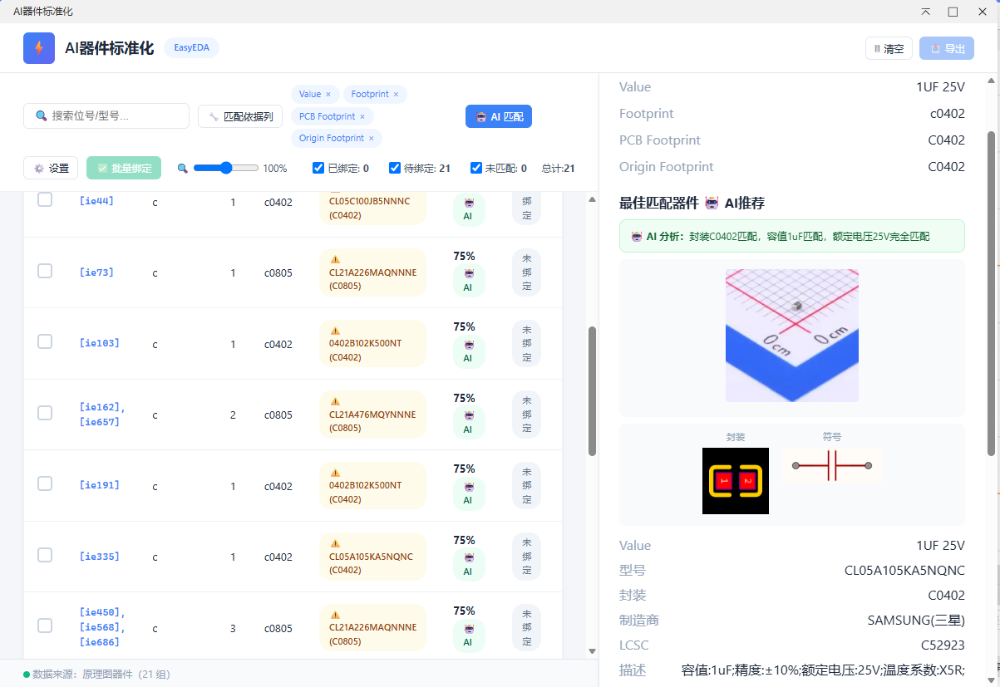
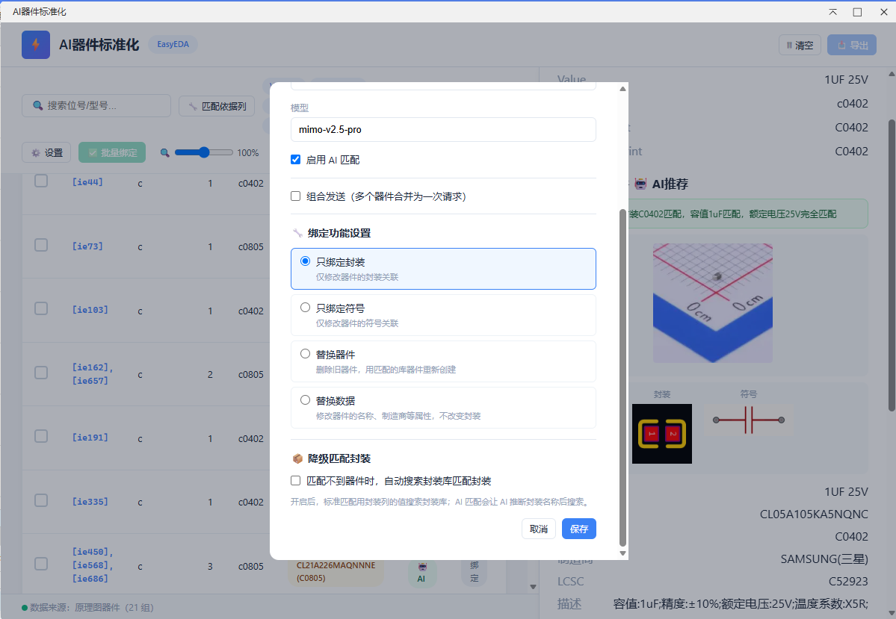
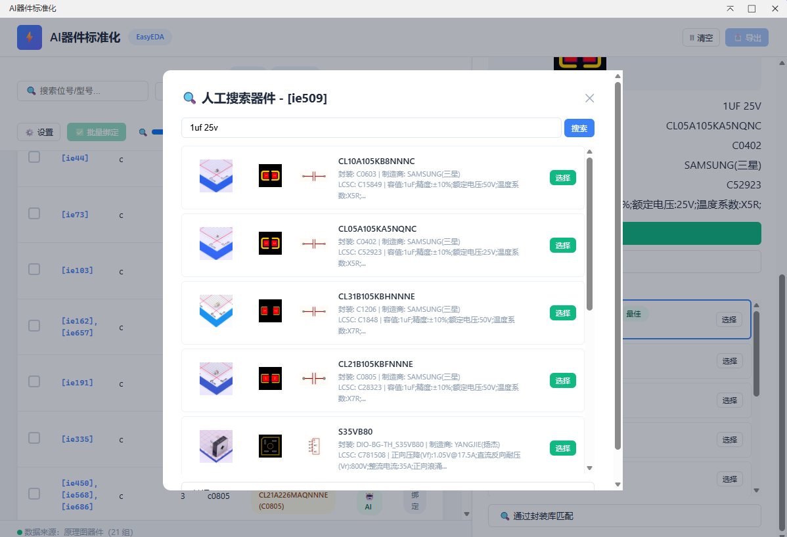
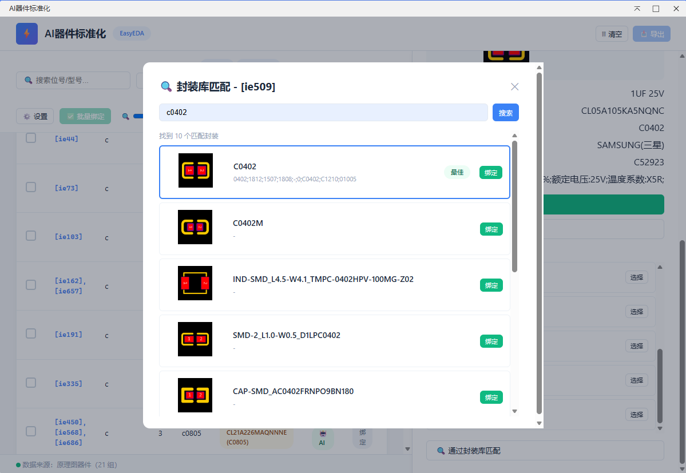

# AI器件标准化

嘉立创EDA专业版扩展插件 —— 从 BOM 文件自动匹配器件封装，支持 AI 智能匹配与一键绑定。

## 功能特性

### 智能匹配
- **标准匹配**：基于用户选定的匹配依据列组合关键词搜索立创器件库
- **AI 匹配**：接入 OpenAI 兼容接口，自动生成搜索关键词、筛选候选器件、推荐最佳匹配
- **批量 AI**：支持多个器件合并为一次 AI 请求，按上下文大小自动分批
- **匹配度计算**：基于多选匹配列的逐列比对，支持完全匹配与包含匹配

### 绑定模式
- **替换器件**：删除旧器件，用匹配的库器件重新创建
- **仅替换封装**：保持原有符号不变，仅修改器件的封装关联
- **仅替换符号**：保持原有封装不变，仅修改器件的符号关联
- **替换数据**：修改器件的名称、制造商等属性，不改变封装与符号

### 手动匹配
- 无法自动匹配的器件可手动输入关键词检索器件库
- 检索结果展示器件详情、符号图、封装图预览
- 支持手动封装库匹配，独立搜索封装库并预览

| 器件库手动搜索 | 封装库手动搜索 |
| --- | --- |
|  |  |

## 使用方法

1. 在原理图编辑器中，点击菜单栏 **AI器件标准化 → 打开**
2. 选择「通过原理图匹配」自动读取器件，或「通过BOM匹配」导入外部 BOM 文件
3. 点击「🔧 匹配依据列」选择用于匹配的 BOM 数据列
4. 点击「⚙️ 设置」配置 AI 匹配、绑定模式、降级匹配封装等选项
5. 点击「🔄 匹配」执行匹配
6. 查看匹配结果，点击「绑定」或「批量绑定」完成封装绑定
7. 需要还原时，点击「解绑」恢复原始器件
